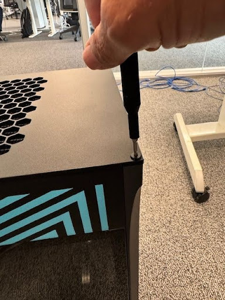
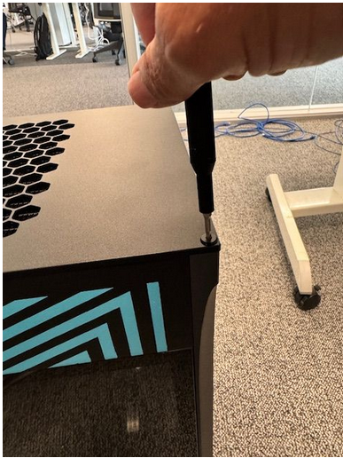
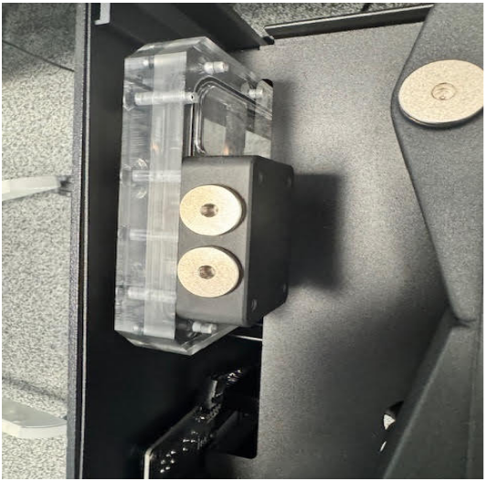

---
myst:
  html_meta:
    product-name: TT-QuietBox
    technology-concepts: troubleshooting, BIOS, PCIe, coolant, maintenance
    document-type: troubleshooting
---

# **Troubleshooting Common Hardware Issues**
This guide assists users in diagnosing and resolving common hardware issues with the TT-QuietBox™ system, including system instability, boot failures, and long-term maintenance tasks such as coolant refilling.

## **Resolving System Instability or Random Reboots After a BIOS Change**

If your system experiences random reboots or stability issues after a BIOS update or reset, a specific setting may be incorrectly configured.

**Cause:** The PCIe Advanced Error Reporting (AER) mechanism is not configured to allow the operating system to handle error reporting. This misconfiguration can interfere with Tenstorrent's system management software.

**Solution:** Set the reporting mechanism to **OS First**.

1. Enter the system **BIOS** during boot.  
2. Navigate to **Advanced** \> **AMD CBS** \> **NBIO Common Options** \> **NBIO RAS Common Options**.  
3. Locate the setting for **PCIe AER Reporting Mechanism**.  
4. Change the value to **OS First**.  
5. Save changes and exit the **BIOS**.  

---

## **Resolving Boot Failures or Undetected Cards**
If your system does not boot, or if Tenstorrent hardware does not appear in software utilities such as `tt-smi`, the PCIe cards may be unseated.

:::{note}
Extended boot times are normal during the first boot or after a power loss event. System memory training can take up to 10 minutes to complete. This behavior does not indicate a boot failure.
:::

**Cause:** One or more PCIe cards may have become loose during shipment or relocation.

**Solution:** Reseat the PCIe cards manually.

:::{warning}
This procedure requires technical expertise and careful handling to avoid damaging system components. Proceed with caution.
:::

### **Required Tools**

* `2.5mm security hex bit`
* `2.0mm security hex bit`
* Phillips head screwdriver

### **Reseating Procedure**

1. Place the system on its side. Use a `2.5mm security hex bit` to unscrew the chassis top panel and access the PCIe cards.  

   

2. Carefully remove the front glass panel and set it aside in a safe location.  

   

3. Use a `2.0mm security hex bit` to unscrew and remove the center retention bar that secures the PCIe cards.  

   

4. Remove the Phillips head screws that secure the PCIe card shields to the back of the chassis.  
5. Pull the quick-disconnect shield back and gently pull the hoses to detach the cooling tubes from the cards.  

   

6. Carefully remove the cards from their **PCIe** slots.  
7. Re-insert each card firmly into its **PCIe** slot. Apply counter-pressure to the motherboard to prevent it from flexing.  
8. Reinstall all retention bars, screws, cooling tubes, and panels in the reverse order of removal.  
9. Boot the system and run `tt-smi` to confirm all cards are detected.

If the system still fails to boot and displays a `00 POST` code for an extended period, you may need to reset the CMOS. Power down the system, short the `CLRMOS1` jumper on the motherboard, then remove and reinstall the CMOS battery.

---

## **Refilling Coolant After Long-Term Use**

**Cause:** Over time, a small amount of coolant may evaporate from the liquid cooling loop. This is normal for all liquid-cooled systems.

:::{note}
Your TT-QuietBox™ system ships with sufficient coolant for immediate and long-term operation. You do not need to add coolant to a new system. This procedure is only for maintenance after extended use.
:::

**Solution:** Refill the coolant using the correct mixture.

### **Required Materials**

* `Mayhems XT1 Clear Concentrate`  
* `Distilled water`

:::{warning}
You must use distilled water. Tap water or other water types contain minerals and contaminants that can damage the cooling system.
:::

### **Refilling Procedure**

1. Prepare the coolant mixture. The correct ratio is 38% `Mayhems XT1 Clear Concentrate` to 62% `distilled water`(e.g., 380ml of concentrate mixed with 620ml of distilled water).  
2. Remove the top cover of the system by removing the four corner screws.  

   

3. Locate the two ports on top of the coolant reservoir. The port closer to the long edge of the reservoir is the **fill port**; the port closer to the short edge is the **purge port**.  

   

4. Unscrew the plugs from both ports.  
5. Slowly pour the prepared coolant mixture into the **fill port**. Air will escape from the **purge port**.  
6. Once the reservoir is full, securely reinstall both `G1/4` plugs and replace the top cover of the system.

:::{note}
Hearing a light buzzing sound or seeing bubbles in the loop after a refill is normal. This is harmless and will resolve as the air works its way back to the reservoir.
:::

---

## **Need Additional Support?**
If you encounter any issues, or have a question that isn't covered in the documentation, please [raise a support request.](https://tenstorrent.atlassian.net/servicedesk/customer/portal/1) Our team will review your request and provide assistance.
