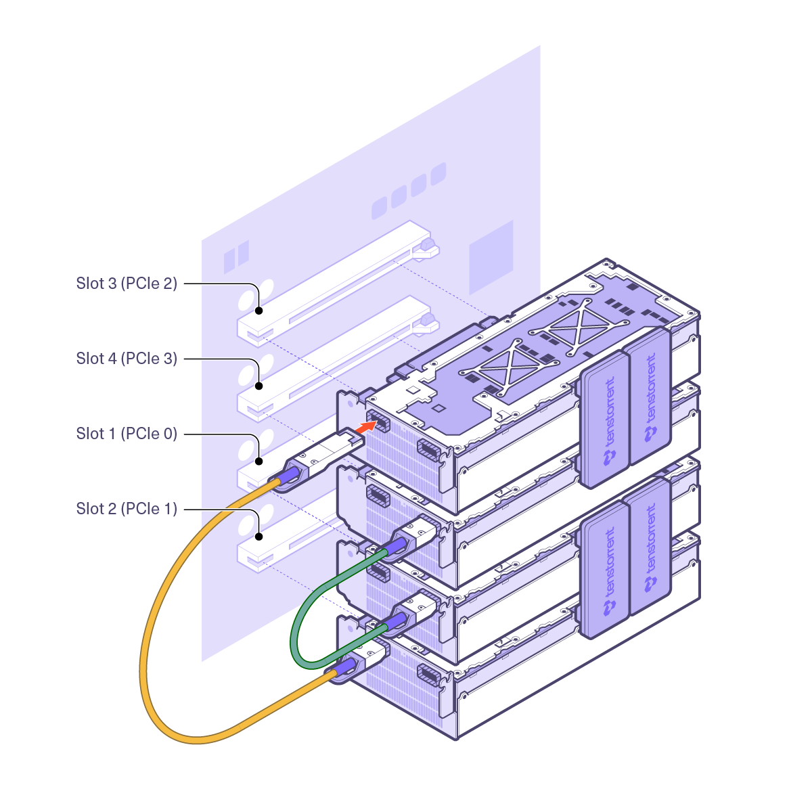

# Specifications, Requirements, and Setup

## Package Contents

The Tenstorrent TT-LoudBox (T3000) 4U/Desktop Workstation system package includes:

- Tenstorrent TT-LoudBox (T3000) 4U/Desktop Workstation system
- C13 Power Cable, 1.8m/6ft.
- 4U Rack-Mounting Kit
- 2x QSFP-DD 400GbE Cable, 0.6m/2ft. (TW-02002 only)

## System Specifications

| Specification         | TT-LoudBox (TW-02001)                                        | TT-LoudBox (TW-02002)                                        |
| --------------------- | ------------------------------------------------------------ | ------------------------------------------------------------ |
| **CPU**               | 2x Intel® Xeon® Silver 4309Y (8C/16T ea., up to 2.8GHz, 105W, [Ark](https://ark.intel.com/content/www/us/en/ark/products/215275/intel-xeon-silver-4309y-processor-12m-cache-2-80-ghz.html)) | 2x Intel® Xeon® Silver 4309Y (8C/16T ea., up to 2.8GHz, 105W, [Ark](https://ark.intel.com/content/www/us/en/ark/products/215275/intel-xeon-silver-4309y-processor-12m-cache-2-80-ghz.html)) |
| **Memory**            | 256GB (8x32GB) DDR4-3200 ECC RDIMM (12 Slots Free) | 512GB (16x32GB) DDR4-3200 ECC RDIMM (12 Slots Free) |
| **Storage**           | 3.8TB U.2 NVMe PCIe 4.0 x4                                   | 3.8TB U.2 NVMe PCIe 4.0 x4                                   |
| **Tensix Processors** | 4x Tenstorrent Wormhole™ n150s Tensix Processor              | 4x Tenstorrent Wormhole™ n300s Tensix Processor* 4x Warp 100 Interconnects |
| **Cables**            | -                                                            | 2x QSFP-DD 400GbE Cable, 0.6m/2ft.                           |
| **Connectivity**      | 2x RJ45 10GBase-T via Intel® X550-AT 5x USB 3.1 Gen 1 (5GBps) Type-A (2x Front, 3x Rear) 1x USB 3.1 Gen 1 (5GBps) Type-C 1x COM 1x VGA 1x IPMI | 2x RJ45 10GBase-T via Intel® X550-AT 5x USB 3.1 Gen 1 (5GBps) Type-A (2x Front, 3x Rear) 1x USB 3.1 Gen 1 (5GBps) Type-C 1x COM 1x VGA 1x IPMI |
| **Power Supply**      | 1+1 Titanium Level PSUs 1200W: 100-127Vac 1800W-2090W: 200-240Vac 2200W: 220-240Vac | 1+1 Titanium Level PSUs 1200W: 100-127Vac 1800W-2090W: 200-240Vac 2200W: 220-240Vac* |
| **Base System**       | [SuperMicro SuperServer SYS-740GP-TNRT](https://www.supermicro.com/en/products/system/gpu/4u/sys-740gp-tnrt) | [SuperMicro SuperServer SYS-740GP-TNRT](https://www.supermicro.com/en/products/system/gpu/4u/sys-740gp-tnrt) |
| **Operating System**  | None                                                         | None                                                         |

**200V input or higher input voltage required for TW-02002.*

**NOTE:** The MAC address and password for the BMC (baseboard management controller) can be found on labels on both the system chassis and the motherboard. A small slide-out tray with the label is hidden behind the front cover, at the bottom of the system. The label will look like this:

## Operating System Requirements

The Tenstorrent TT-LoudBox system ships without an operating system installed. We recommend installing Ubuntu 20.04 (Focal Fossa) to properly use the Tenstorrent Tensix Processors.

## 4U Rack-Mounting Instructions

The Tenstorrent TT-LoudBox ships assembled for desktop use. Instructions to rack-mount the system using the included 4U rack-mounting kit are available in Chapter 2 of the Manual for the [SuperMicro SuperServer SYS-740GP-TNRT](https://www.supermicro.com/en/products/system/gpu/4u/sys-740gp-tnrt).

## QSFP-DD Connections and System Topology (TW-02002)

The Tenstorrent TT-LoudBox configuration in TW-02002 includes four Wormhole™ n300s Tensix Processors and internal Warp 100 bridges and external QSFP-DD cables that enable the Tensix Processor mesh.

The TT-LoudBox ships with the Warp 100 bridges connected, but the two QSFP-DD cables will need to be connected. This diagram displays the system topology and how the cards are enumerated, along with where the Warp 100 bridges are connected and where the included QSFP-DD cables need to be connected. 

One QSFP-DD cable will need to be connected to **Port 1** on the cards in **Slots 1 and 4**.

One QSFP-DD cable will need to be connected to **Port 2** on the cards in **Slots 3 and 2**.

## Environment Specifications

Please visit the Tenstorrent Wormhole n150s and n300s [specification page](../../aibs/wormhole/specifications.md) for environment specifications for those cards.

Please visit the [SuperMicro SuperServer SYS-740GP-TNRT](https://www.supermicro.com/en/products/system/gpu/4u/sys-740gp-tnrt) page for environment specifications for this system.